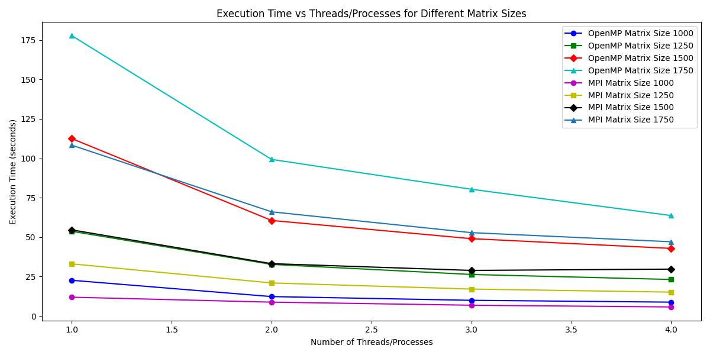
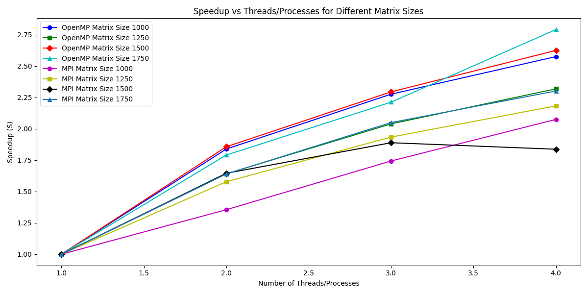
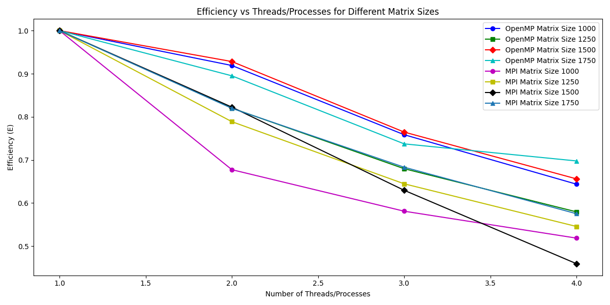

# Laboratory Activity # 1: Parallel and Distributed Matrix Multiplication

This activity explores the implementation of **parallel** and **distributed** algorithms for matrix multiplication, showcasing the advantages of computational efficiency and scalability in high-performance computing environments.

---

## Running the program

Follow these steps to execute the program:

1. **Make the code executable then run the program**:
  ```bash
  chmod +x run.sh
  ```
  ```bash
  ./run.sh
  ```

After running the program:
- A `.txt` file containing execution time data will be generated.
- Graphs based on your generated data will be displayed.
- You can adjust the **matrix size** and the **number of threads/cores** by modifying the `run.sh` script

---

## Understanding the Graphs
The results of your generated data will be visualized through graphs. Note that the data may vary depending on factors like your CPU's cores/threads and system performance. Below is an explanation of the graphs:

### Execution Time Comparison
This graph illustrates the execution time for matrix multiplication under different matrix sizes and varying numbers of threads/processes. It highlights how increasing the number of threads/processes impacts computational time.



---

### Speedup (S)
Speedup quantifies the performance improvement achieved by parallel execution compared to sequential execution.

**Formula**:

```math
S = \frac{T_1}{T_p}
```
Where:
- $\( T_1 \)$: Execution time of the task on a single thread or process.
- $\( T_p \)$: Execution time of the task on $\( p \)$ threads or processes.

**Description**:
- A **higher speedup** indicates better performance, as the task is completed faster when more threads/processes are used.
- Ideally, \( S \) should be equal to the number of threads or processes \( p \) (i.e., **linear speedup**). However, due to communication overhead, synchronization, and non-parallelizable portions of the task, the actual speedup is often less than \( p \).



---

### Efficiency (E)

Efficiency measures how effectively computational resources (threads or processes) are utilized during parallel execution.

**Formula**:
```math
E = \frac{S}{p} = \frac{T_1}{p \cdot T_p}
```
Where:
- $\( S \)$: Speedup.
- $\( p \)$: Number of threads or processes.

**Description**:
- Efficiency ranges from 0 to 1 (or 0% to 100%):
  - $\( E = 1 \)$ (or 100%) implies perfect utilization of resources.
  - $\( E < 1 \)$ indicates some loss in resource efficiency, often due to communication overhead, load imbalance, or sequential portions of the workload.

